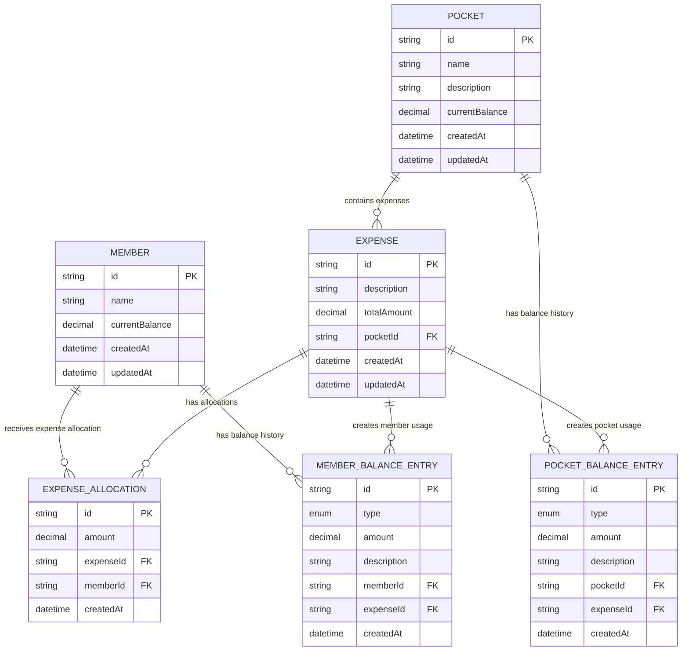
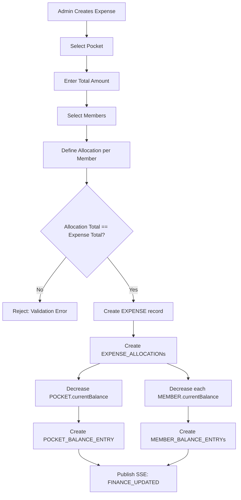

# Database Schema Document (DB)

# Trip Finance Dashboard

**Version:** 1.1.0  
**Engine:** PostgreSQL (Supabase)  
**ORM:** Prisma 7  
**Status:** Draft  

---

# 1. Entity-Relationship Diagram

---

# 2. Enum Definitions

## 2.1 BalanceEntryType

Used in `MEMBER_BALANCE_ENTRY.type` and `POCKET_BALANCE_ENTRY.type`.

| Value | Description |
|-------|-------------|
| `DEPOSIT` | Money added to a member's balance (income). |
| `EXPENSE` | Money deducted for a shared expense. |
| `ALLOCATION` | Portion of an expense assigned to a specific member. |

---

# 3. Field Specifications

## 3.1 Monetary Precision

All `amount` and `currentBalance` fields use:

| Property | Value |
|----------|-------|
| Type | `Decimal(12,2)` |
| Max value | 9,999,999,999.99 |
| Min value | -9,999,999,999.99 |
| Scale | 2 decimal places |
| Currency | IDR (display formatting only; stored as raw decimal) |

## 3.2 ID Generation

- All `id` fields use CUID2 (via Prisma `@default(cuid())`)
- No auto-increment integers

---

# 4. Indexes

| Table | Column(s) | Type | Purpose |
|-------|-----------|------|---------|
| MEMBER_BALANCE_ENTRY | `memberId` | B-tree | Filter balance history by member |
| MEMBER_BALANCE_ENTRY | `expenseId` | B-tree | Join with expense |
| MEMBER_BALANCE_ENTRY | `createdAt` | B-tree (DESC) | Recent entries query |
| POCKET_BALANCE_ENTRY | `pocketId` | B-tree | Filter balance history by pocket |
| POCKET_BALANCE_ENTRY | `expenseId` | B-tree | Join with expense |
| POCKET_BALANCE_ENTRY | `createdAt` | B-tree (DESC) | Recent entries query |
| EXPENSE | `pocketId` | B-tree | Filter expenses by pocket |
| EXPENSE_ALLOCATION | `expenseId` | B-tree | Join with expense |
| EXPENSE_ALLOCATION | `memberId` | B-tree | Filter allocations by member |

---

# 5. Foreign Key Constraints

| FK Column | From | To | On Delete | Rationale |
|-----------|------|----|-----------|-----------|
| `memberId` | MEMBER_BALANCE_ENTRY | MEMBER | `RESTRICT` | Prevent orphaned financial history |
| `expenseId` | MEMBER_BALANCE_ENTRY | EXPENSE | `RESTRICT` | Prevent orphaned financial history |
| `pocketId` | POCKET_BALANCE_ENTRY | POCKET | `RESTRICT` | Prevent orphaned financial history |
| `expenseId` | POCKET_BALANCE_ENTRY | EXPENSE | `RESTRICT` | Prevent orphaned financial history |
| `pocketId` | EXPENSE | POCKET | `RESTRICT` | Prevent orphaned expenses |
| `expenseId` | EXPENSE_ALLOCATION | EXPENSE | `CASCADE` | Allocations deleted with expense |
| `memberId` | EXPENSE_ALLOCATION | MEMBER | `RESTRICT` | Prevent orphaned allocations |

---

# 6. Expense Creation Flow

---

# 7. Soft Delete Strategy

- Financial records (entries, allocations) use `ON DELETE RESTRICT` — they are **permanent**.
- `MEMBER` and `POCKET` may be **hard deleted** only when they have zero financial history.
- Future: add `deletedAt` timestamp if archival/restore is needed.

---

# 8. Prisma Schema Mapping

- **Generator:** `prisma-client` → output `lib/generated/prisma`
- **Datasource:** PostgreSQL via Supabase
- **Driver adapter** required for Prisma 7 runtime
