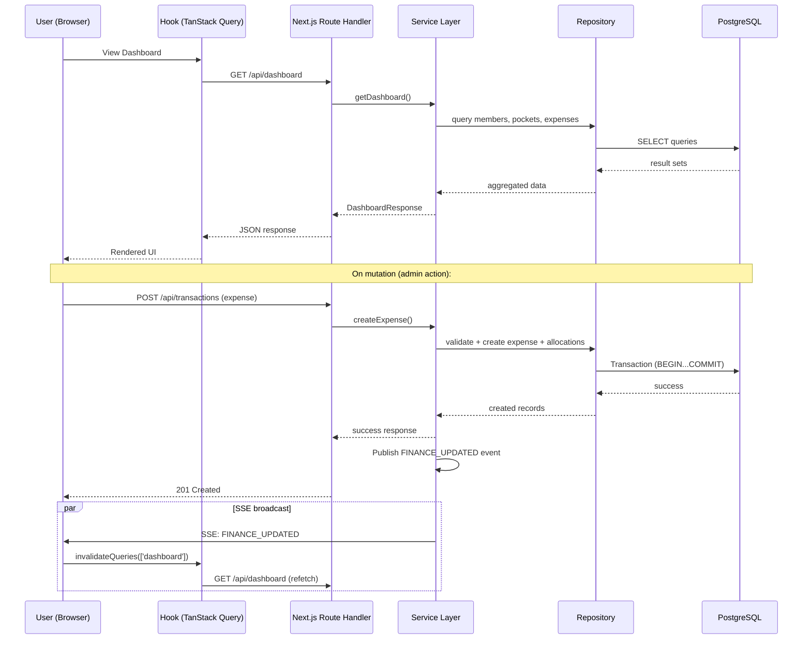

# Technical Requirements Document (TRD)

# Trip Finance Dashboard

**Version:** 1.1.0  
**Status:** Draft  
**Application Type:** Fullstack Mobile-Only Web Application (no desktop layout)  

---

# 1. Technical Overview

Trip Finance Dashboard is a fullstack web application designed to transparently track financial activities during a trip or event.

The application allows:

- Public users to view financial data.
- Admin users to manage financial data.
- Real-time dashboard updates through Server-Sent Events (SSE).
- REST API-based communication between the frontend and backend.
- PostgreSQL-based persistent data storage.

The application is deployed as a single Next.js application on Railway.

The database is hosted on Supabase PostgreSQL.

---

# 2. Design & UX Skills

UI implementation follows these installed skills:

| Skill | When to Use |
|-------|-------------|
| **`design-taste-frontend`** | Before building any new page or major component. Run Design Read → set Three Dials (DESIGN_VARIANCE, MOTION_INTENSITY, VISUAL_DENSITY) → determine layout, color, typography, and animation approach. |
| **`ui-ux-pro-max`** | During implementation for UX decisions. Reference priority categories: §1 Accessibility (CRITICAL), §2 Touch & Interaction, §5 Layout & Responsive, §6 Typography & Color, §7 Animation, §8 Forms & Feedback, §9 Navigation Patterns, §10 Charts & Data. |

---

# 3. Technology Stack

## 3.1 Frontend

```
Next.js 16
React 19
TypeScript
Tailwind CSS v4
shadcn/ui (base-nova style)
  └─ @base-ui/react (primitives)
Lucide React (icons)
TanStack Query v5 (server state)
React Hook Form + Zod (forms)
```

## 3.2 Backend

```
Next.js Route Handlers (REST API)
Service Layer (business logic)
Repository Layer (data access)
Server-Sent Events (realtime)
```

## 3.3 Animation & Interaction

```
motion/react (micro-interactions, entry/exit transitions)
GSAP + ScrollTrigger (scroll-driven animations, if needed)
```

Animation principles:
- Animate only `transform` and `opacity` (hardware accelerated).
- Micro-interactions: 150-300ms, ease-out for enter, ease-in for exit.
- Respect `prefers-reduced-motion`.
- Never use `window.addEventListener('scroll', ...)` — use GSAP ScrollTrigger or Motion's `useScroll`.

## 3.4 Database & ORM

```
PostgreSQL (Supabase)
Prisma 7 (ORM)
  └─ Driver adapter (e.g., @prisma/adapter-neon or @prisma/adapter-pg)
  └─ prisma-client generator → lib/generated/prisma
  └─ prisma.config.ts (v7 config file)
```

## 3.5 Runtime & Deployment

```
Bun (package manager / runtime)
Railway (deployment)
```

---

# 4. Architecture

## 4.1 Modular Monolith

The application follows a Modular Monolith architecture — one codebase, one deployment.

```
One Repository
    ↓
One Next.js Application
    ↓
REST API + SSE
    ↓
Prisma + Driver Adapter
    ↓
PostgreSQL (Supabase)
```

Do not introduce microservices.

## 4.2 Dependency Flow

```
UI (React Components)
 ↓
Hooks (TanStack Query wrappers)
 ↓
API Route Handlers (Next.js)
 ↓
Service Layer (business logic)
 ↓
Repository Layer (data access)
 ↓
Prisma ORM
 ↓
PostgreSQL
```

**Rules:**
- React components never query Prisma directly.
- Hooks never call Prisma directly.
- All database access goes through Service → Repository → Prisma.

---

# 5. Component Architecture

## 5.1 Route Tree

```
app/ (root layout + globals + providers)
├── (public)/layout.tsx
│   └── page.tsx (main dashboard — guests)
│
├── admin/layout.tsx
│   ├── login/page.tsx
│   └── page.tsx (admin dashboard)
│
└── api/
    ├── auth/me/route.ts
    ├── auth/login/route.ts
    ├── auth/logout/route.ts
    ├── dashboard/route.ts
    ├── events/route.ts (SSE)
    ├── members/route.ts + [id]/route.ts
    ├── pockets/route.ts + [id]/route.ts
    └── transactions/route.ts + [id]/route.ts
```

## 5.2 Component Hierarchy (Dashboard Page)

```
DashboardPage (RSC)
├── DashboardSummary (card: total balance, income, expenses)
├── PocketList (grid of pocket cards)
│   └── PocketCard (name, balance, progress)
├── MemberList (member cards with balances)
│   └── MemberCard (avatar, name, balance, deposit button)
├── TransactionList (recent transactions)
│   └── TransactionRow (description, amount, date, pocket)
└── LoadingSkeleton (shown during data fetch)
    └── SkeletonCard × N
```

## 5.3 Admin Action Pattern

All admin actions follow this pattern:

```
ActionButton (FAB or inline)
  → Modal or BottomSheet
    → Form (react-hook-form + Zod)
    → Submit (TanStack Query mutation)
    → SSE event broadcast
    → Modal closes
    → Dashboard data invalidated
```

---

# 6. Theme System

- **Dark mode** supported via CSS variables and `.dark` class.
- Uses `prefers-color-scheme` by default.
- Admin toggle option for manual override.
- All colors use CSS custom properties defined in `globals.css` (shadcn format).
- Every new component is built with both light and dark variants.

---

# 7. Form Patterns

All forms (admin actions) follow these conventions:

| Element | Convention |
|---------|------------|
| Library | `react-hook-form` + `@hookform/resolvers/zod` |
| Validation | Zod schema per entity |
| Label | Visible label above input (never placeholder-only) |
| Error | Inline error below the field on blur |
| Submit | Disable button during async, show spinner |
| Success | Brief toast, auto-dismiss |
| Touch targets | Input height ≥ 44px |

---

# 8. SSE (Server-Sent Events) Flow

```
1. Client (use-financial-events.ts):
   new EventSource('/api/events')
   → listens for 'FINANCE_UPDATED' event
   → calls queryClient.invalidateQueries({ queryKey: ['dashboard'] })

2. Server (api/events/route.ts):
   → SSE endpoint with ReadableStream
   → sse-manager.ts tracks open connections
   → On FINANCE_UPDATED event, broadcasts to all connections

3. Trigger:
   → transaction.service.ts publishes event after every mutation
   → event-bus.ts dispatches to sse-manager
```

---

# 9. Prisma 7 Configuration

- **Config file:** `prisma.config.ts` (separate from `next.config.ts`)
- **Generator output:** `lib/generated/prisma` (outside `node_modules`)
- **Driver adapter:** Required at runtime (e.g., `@prisma/adapter-neon` or `@prisma/adapter-pg`)
- **Schema:** `prisma/schema.prisma`
- **Migration path:** `prisma/migrations/`

```
import { defineConfig } from "prisma/config";

export default defineConfig({
  schema: "prisma/schema.prisma",
  migrations: { path: "prisma/migrations" },
  datasource: { url: process.env["DATABASE_URL"] },
});
```

---

# 10. Error Handling Strategy

## 10.1 Backend

```
AppError class (custom error with code + status + message)
  → error-handler.ts
    → maps to NextResponse.json({ error: { code, message } }, { status })
```

Standard error codes: `VALIDATION_ERROR`, `NOT_FOUND`, `UNAUTHORIZED`, `CONFLICT`, `INTERNAL_ERROR`.

## 10.2 Frontend

- **API client** (`lib/http/api-client.ts`): wraps fetch, throws structured errors.
- **TanStack Query**: `onError` callbacks per mutation.
- **Error boundaries**: one per page section.
- **Toast**: transient errors (network, save failure).
- **Inline**: form validation errors.

---

# 11. State Management

| Concern | Tool |
|---------|------|
| Server data (dashboard, members, pockets, transactions) | TanStack Query |
| UI state (modal open/close, form state) | `useState` / `useReducer` |
| SSE events (invalidation trigger) | TanStack Query `invalidateQueries` |
| Admin session | Server-side session (HTTP-only cookie) |

---

# 12. Data Flow Diagram



---

# 13. Financial Calculation Rules

## 13.1 Member Balance

```
member.currentBalance =
  SUM(deposits) - SUM(expense allocations)
```

## 13.2 Pocket Balance

```
pocket.currentBalance =
  SUM(income into pocket) - SUM(expenses from pocket)
```

## 13.3 Validation

```
All expense allocation amounts must equal the expense total amount.
No financial record can be updated or deleted after creation (append-only).
```
